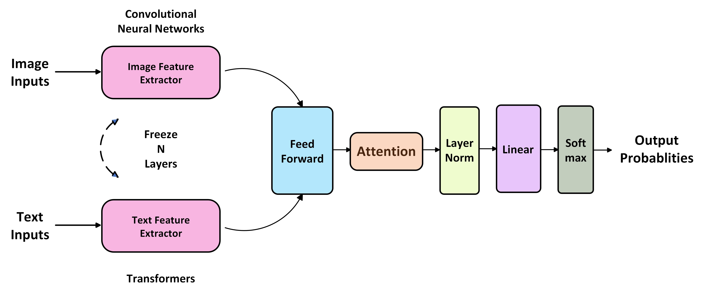
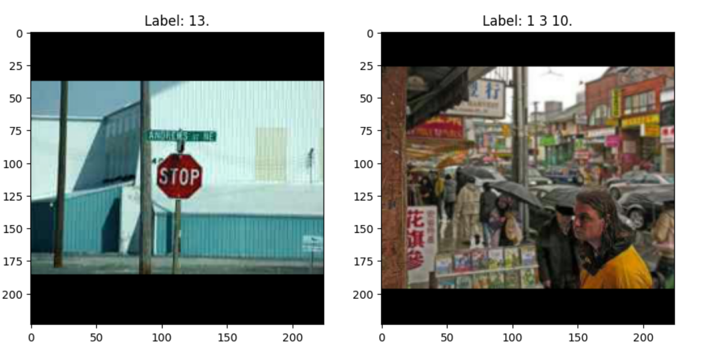
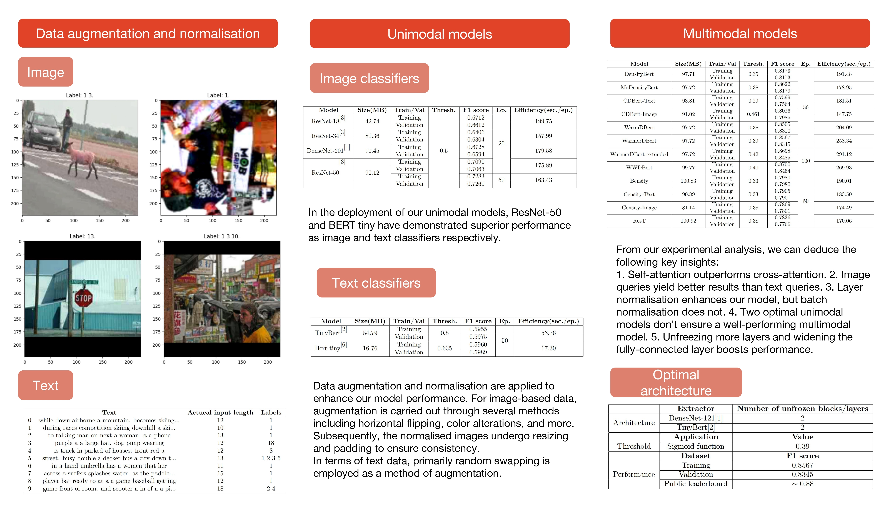

English Version | [中文版](README.zh-CN.md)

# :heart_eyes_cat: CAT:  Convolutions, Attention & Transformers
:rocket: Dive into the world of **CAT**! Imagine if computers could understand and combine the essence of both pictures and words, just like we humans naturally do. By marrying the strengths of Convolutions (think of it as the magic behind image filters) and Transformers (the genius tech behind language models), our **CAT** framework stands as a bridge, seamlessly blending visual and textual realms. So, whether you're marveling at a sunset photo or reading a poetic description, **CAT** seeks to decode, understand, and bring them together in harmony.

# :book:
## :sparkles: 1. Introduction
In this experimental endeavor, an innovative model architecture is proposed that leverages the capabilities of Convolutional Neural Networks (CNNs) for the extraction of salient features from images, and Transformer-based models for gleaning intricate patterns from textual data. Termed the **C**onvolutions, **A**ttention & **T**ransformers or the **CAT** framework, the architecture deftly integrates attention mechanisms. These mechanisms serve as an intermediate conduit, facilitating the seamless amalgamation of visual and textual modalities.

<p align="center">
  
  <br>
  This is my 'CAT'!
</p>

<p align="center">
  
  <br>
  Hmmm...NOT this 'CAT'.
</p>

## :sparkles: 2. Hyperparameters of the optimal model
<div align="center">
<table style="text-align: center;">
  <tr>
    <td align="center" colspan="4"><strong>Architecture</strong></td>
  </tr>
  <tr>
    <td align="center" rowspan="3">Extractor</td>
    <td align="center">Modality</td>
    <td align="center">Module</td>
    <td align="center">Number of Unfrozen Blocks</td>
  </tr>
    <td align="center">Image</td>
    <td align="center">DenseNet-121</td>
    <td align="center" rowspan="2">2</td>
  <tr>
    <td align="center">Text</td>
    <td align="center">TinyBert</td>
  </tr>
  <tr>
    <td align="center" rowspan="4">Parallelism</td>
    <td align="center">Property</td>
    <td align="center">Module</td>
    <td align="center">Number of Input Dimensions</td>
  </tr>
    <td align="center" rowspan="3">Fully-connected</td>
    <td align="center">Batch Normalization</td>
    <td align="center" rowspan="3">896</td>
  </tr>
  </tr>
    <td align="center">ReLU</td>
  </tr>
  </tr>
    <td align="center">Dropout</td>
  </tr>
  </tr>
    <td align="center" colspan="4">Attention</td>
  </tr>
  </tr>
    <td align="center" rowspan="2">Classifier</td>
    <td align="center">Property</td>
    <td align="center">Module</td>
    <td align="center">Number of Input Dimensions</td>
  </tr>
  </tr>
    <td align="center" colspan="2">Linear</td>
    <td align="center">896*2</td>
  </tr>
</table>
</div>

<div align="center">
<table style="text-align: center;">
  <tr>
    <td align="center" colspan="4"><strong>Training procedure</strong></td>
  </tr>
    <tr>
    <td align="center"></td>
    <td align="center">Class</td>
    <td align="center">Details</td>
  </tr>
  <tr>
    <td align="center" rowspan="2">Strategy</td>
    <td align="center">Batch Size</td>
    <td align="center">16</td>
  </tr>
  <tr>
    <td align="center">Number of epochs</td>
    <td align="center">50</td>
  </tr>
  <tr>
    <td align="center" rowspan="4">Optimization</td>
    <td align="center">Loss Function</td>
    <td align="center">Binary Cross Entropy With Logits</td>
  </tr>
  <tr>
    <td align="center">Optimizer</td>
    <td align="center">AdamW</td>
  </tr>
  <tr>
    <td align="center">Learning Rate</td>
    <td align="center">1e-5</td>
  </tr>
  <tr>
    <td align="center">Bias Correction</td>
    <td align="center">False</td>
  </tr>
  <tr>
    <td align="center" rowspan="3">Auxiliary</td>
    <td align="center">Learning Rate Scheduler</td>
    <td align="center">Linear</td>
  </tr>
   <tr>
    <td align="center">Number of Warmup Steps</td>
    <td align="center">0</td>
  </tr>
  </tr>
   <tr>
    <td align="center">Number of Training Steps</td>
    <td align="center">Total Number of Batches</td>
  </tr>
  <tr>
    <td align="center">Prediction</td>
    <td align="center">Output threshold</td>
    <td align="center">0.39</td>
  </tr>
</table>
</div>

## :sparkles: 3. Data processing

:bulb: How to process multimodal data? That is a good point!

### 3.1 Image data
```python
# Customise ImageDataset
class ImageDataset(Dataset):
  def __init__(self, imgid_label, img_folder, transform=None):
    self.imgid_label = imgid_label
    self.img_folder = img_folder
    self.transform = transform

  def __getitem__(self, idx):
    imgid_ = self.imgid_label[idx][0]
    label_ = self.imgid_label[idx][1]
    img_path = os.path.join(self.img_folder, imgid_)
    img = Image.open(img_path).convert("RGB")
    if self.transform:
      img = self.transform(img)
    return img, label_

  def __len__(self):
    return len(self.imgid_label)

# Define a normalisation transformation, including Resize and Padding
class ResizeLongEdgeAndPad(object):
  def __init__(self, size, padding_mode='constant', fill=0):
    self.size = size
    self.padding_mode = padding_mode
    self.fill = fill

  def __call__(self, img):
    w, h = img.size
    if h > w:
      new_h = self.size
      new_w = int(self.size * w / h)
    else:
      new_w = self.size
      new_h = int(self.size * h / w)

    img = img.resize((new_w, new_h), Image.BICUBIC)

    pad_w = self.size - new_w
    pad_h = self.size - new_h

    padding = (pad_w // 2, pad_h // 2, pad_w - pad_w // 2, pad_h - pad_h // 2)
    return ImageOps.expand(img, padding, fill=self.fill)

augments = transforms.Compose([
    transforms.RandomHorizontalFlip(),
    transforms.RandomVerticalFlip(),
    transforms.RandomRotation(20),
    transforms.ColorJitter(brightness=0.5, contrast=0.5, saturation=0.5, hue=0.1),
    transforms.Resize(232),
    transforms.RandomResizedCrop((224, 224), scale=(0.1, 1), ratio=(0.7, 1.0/0.7)),
    transforms.ToTensor(),
    transforms.Normalize([0.485, 0.456, 0.406], [0.229, 0.224, 0.225])
    ])

# Define the normalisation method for test set
normalise = transforms.Compose([
    ResizeLongEdgeAndPad(224),
    transforms.ToTensor(),
    transforms.Normalize([0.485, 0.456, 0.406], [0.229, 0.224, 0.225])
])
```
<p align="center">
  
  <br>
  Image Data Augmentation
</p>

<p align="center">
  
  <br>
  Image Data Normalization
</p>

### 3.2 Text data
```python
min_length=23
# Define a text data augmentation - random swap
def random_swap(words, n):
  words = words.copy()
  for _ in range(n):
    if len(words) < 2:
      break
    idx1, idx2 = random.sample(range(len(words)), 2)
    words[idx1], words[idx2] = words[idx2], words[idx1]
  return words

# Customise TextDataset
class TextDataset(Dataset):
  def __init__(self, txt_label, tokenizer, max_length, random_swap_=False):
    self.txt_label = txt_label
    self.tokenizer = tokenizer
    self.max_length = max_length
    self.random_swap_ = random_swap_

  def __len__(self):
    return len(self.txt_label)

  def __getitem__(self, idx):
    text = self.txt_label[idx][0]
    label = self.txt_label[idx][1]
    if self.random_swap_:
      words = text.split()
      words = random_swap(words, n=min_length)
      text = ' '.join(words)

    encoding = self.tokenizer.encode_plus(
        text,
        add_special_tokens=True,
        max_length=self.max_length,
        return_token_type_ids=False,
        padding='max_length',
        truncation=True,
        return_attention_mask=True,
        return_tensors='pt',
    )

    return {
        'input_ids': encoding['input_ids'].flatten(),
        'attention_mask': encoding['attention_mask'].flatten(),
        'label': torch.tensor(label, dtype=torch.long)
    }
```
<p align="center">
  
  <br>
  Random swap
</p>

### 3.3 Multimodal data
```python
class MultimodalDataset(Dataset):
  def __init__(self, imgid_txt_label, img_folder, tokenizer, max_length, transform=None, random_swap_=False):
    self.imgid_txt_label = imgid_txt_label
    self.img_folder = img_folder
    self.tokenizer = tokenizer
    self.max_length = max_length
    self.transform = transform
    self.random_swap_ = random_swap_

  def __len__(self):
    return len(self.imgid_txt_label)

  def __getitem__(self, idx):
    imgid_ = self.imgid_txt_label[idx][0]
    text = self.imgid_txt_label[idx][1]
    label = self.imgid_txt_label[idx][2]
    # Image operations
    img_path = os.path.join(self.img_folder, imgid_)
    img = Image.open(img_path).convert("RGB")
    if self.transform:
      img = self.transform(img)
    # Text operations
    if self.random_swap_:
      words = text.split()
      words = random_swap(words, n=5)
      text = ' '.join(words)

    encoding = self.tokenizer.encode_plus(
        text,
        add_special_tokens=True,
        max_length=self.max_length,
        return_token_type_ids=False,
        padding='max_length',
        truncation=True,
        return_attention_mask=True,
        return_tensors='pt',
    )
    txt_dict = {
        'input_ids': encoding['input_ids'].flatten(),
        'attention_mask': encoding['attention_mask'].flatten(),
        'label': torch.tensor(label, dtype=torch.long)
    }
    return img, txt_dict
```

## :sparkles: 4. Evaluation methods
```python
def f1_score_(y_pred, y_true, threshold=0.5):
  y_pred = torch.sigmoid(y_pred)
  y_pred = (y_pred.detach().cpu().numpy() >= threshold).astype(int)
  y_true = y_true.detach().cpu().numpy()
  return f1_score(y_true, y_pred, average='micro')
     

def model_size(model):
  buffer = BytesIO()
  torch.save(model.state_dict(), buffer, _use_new_zipfile_serialization=True)
  size = buffer.tell() / (1024*1024)
  buffer.close()
  return size
```

## :sparkles: 5. Experimental comparison
### 5.1 Image vs. Text classifiers
<div align="center">
<table style="text-align: center;">
  <tr>
    <td align="center" colspan="7"><strong>Image classifiers</strong></td>
  </tr>
  <tr>
    <td align="center">Model</td>
    <td align="center">Size(MB)</td>
    <td align="center">Training/Validation</td>
    <td align="center">Threshold</td>
    <td align="center">F1 score</td>
    <td align="center">Epochs</td>
    <td align="center">Efficiency(second/epoch)</td>
  </tr>
  <tr>
    <td align="center" rowspan="2">ResNet-18</td>
    <td align="center" rowspan="2">42.74</td>
    <td align="center">Training</td>
    <td align="center" rowspan="10">0.5</td>
    <td align="center">0.6712</td>
    <td align="center" rowspan="8">20</td>
    <td align="center" rowspan="2">199.75</td>
  </tr>
  <tr>
    <td align="center">Validation</td>
    <td align="center">0.6612</td>
  </tr>
  <tr>
    <td align="center" rowspan="2">ResNet-34</td>
    <td align="center" rowspan="2">81.36</td>
    <td align="center">Training</td>
    <td align="center">0.6406</td>
    <td align="center" rowspan="2">157.99</td>
  </tr>
 <tr>
    <td align="center">Validation</td>
    <td align="center">0.6304</td>
  </tr>
  <tr>
    <td align="center" rowspan="2">DenseNet-201</td>
    <td align="center" rowspan="2">70.45</td>
    <td align="center">Training</td>
    <td align="center">0.6728</td>
    <td align="center" rowspan="2">179.58</td>
  </tr>
 <tr>
    <td align="center">Validation</td>
    <td align="center">0.6594</td>
  </tr>
  <tr>
    <td align="center" rowspan="4">ResNet-50</td>
    <td align="center" rowspan="4">90.12</td>
    <td align="center">Training</td>
    <td align="center">0.7090</td>
    <td align="center" rowspan="2">175.89</td>
  </tr>
 <tr>
    <td align="center">Validation</td>
    <td align="center">0.7063</td>
  </tr>
  <tr>
    <td align="center">Training</td>
    <td align="center">0.7283</td>
    <td align="center" rowspan="2">50</td>
    <td align="center" rowspan="2">163.43</td>
  </tr>
  <tr>
    <td align="center">Validation</td>
    <td align="center">0.7260</td>
  </tr>
  <tr>
    <td align="center" colspan="7"><strong>Text classifiers</strong></td>
  </tr>
  <tr>
    <td align="center">Model</td>
    <td align="center">Size(MB)</td>
    <td align="center">Training/Validation</td>
    <td align="center">Threshold</td>
    <td align="center">F1 score</td>
    <td align="center">Epochs</td>
    <td align="center">Efficiency(second/epoch)</td>
  </tr>
  <tr>
    <td align="center" rowspan="2">Tiny Bert</td>
    <td align="center" rowspan="2">54.79</td>
    <td align="center">Training</td>
    <td align="center" rowspan="2">0.5</td>
    <td align="center">0.5955</td>
    <td align="center" rowspan="2">50</td>
    <td align="center" rowspan="2">53.76</td>
  </tr>
  <tr>
    <td align="center">Validation</td>
    <td align="center">0.5975</td>
  </tr>
  <td align="center" rowspan="2">Bert Tiny</td>
    <td align="center" rowspan="2">16.76</td>
    <td align="center">Training</td>
    <td align="center" rowspan="2">0.635</td>
    <td align="center">0.5960</td>
    <td align="center" rowspan="2">50</td>
    <td align="center" rowspan="2">17.30</td>
  </tr>
  <tr>
    <td align="center">Validation</td>
    <td align="center">0.5989</td>
</table>
</div>

### 5.2 Unimodal vs. Multimodal models
<div align="center">
<table style="text-align: center;">
  <tr>
    <td align="center" colspan="7"><strong>Unimodal models(Optimal)</strong></td>
  </tr>
  <tr>
    <td align="center">Model</td>
    <td align="center">Size(MB)</td>
    <td align="center">Training/Validation</td>
    <td align="center">Threshold</td>
    <td align="center">F1 score</td>
    <td align="center">Epochs</td>
    <td align="center">Efficiency(second/epoch)</td>
  </tr>
  <tr>
    <td align="center" rowspan="2">ResNet-50</td>
    <td align="center" rowspan="2">90.12</td>
    <td align="center">Training</td>
    <td align="center" rowspan="2">0.5</td>
    <td align="center">0.7283</td>
    <td align="center" rowspan="4">50</td>
    <td align="center" rowspan="2">163.43</td>
  </tr>
  <tr>
    <td align="center">Validation</td>
    <td align="center">0.7260</td>
  </tr>
  <tr>
    <td align="center" rowspan="2">Bert Tiny</td>
    <td align="center" rowspan="2">16.76</td>
    <td align="center">Training</td>
    <td align="center" rowspan="2">0.635</td>
    <td align="center">0.5960</td>
    <td align="center" rowspan="2">17.30</td>
  </tr>
  <tr>
    <td align="center">Validation</td>
    <td align="center">0.5989</td>
  </tr> 
    <td align="center" colspan="7"><strong>Multimodal models(Baseline)</strong></td>
  </tr>
  <tr>
    <td align="center">Model</td>
    <td align="center">Size(MB)</td>
    <td align="center">Training/Validation</td>
    <td align="center">Threshold</td>
    <td align="center">F1 score</td>
    <td align="center">Epochs</td>
    <td align="center">Efficiency(second/epoch)</td>
  </tr>
  <tr>
    <td align="center" rowspan="2">DensityBert(DenseNet-121 + TinyBert)</td>
    <td align="center" rowspan="2">97.71</td>
    <td align="center">Training</td>
    <td align="center" rowspan="2">0.35</td>
    <td align="center">0.8173</td>
    <td align="center" rowspan="6">50</td>
    <td align="center" rowspan="2">191.48</td>
  </tr>
  <tr>
    <td align="center">Validation</td>
    <td align="center">0.8173</td>
  </tr>
  <tr>
    <td align="center" rowspan="2">Bensity(DenseNet-201 + BertTiny)</td>
    <td align="center" rowspan="2">100.83</td>
    <td align="center">Training</td>
    <td align="center" rowspan="2">0.33</td>
    <td align="center">0.7980</td>
    <td align="center" rowspan="2">190.01</td>
  </tr>
  <tr>
    <td align="center">Validation</td>
    <td align="center">0.7980</td>
  </tr>
  <tr>
    <td align="center" rowspan="2">ResT(ResNet-34 + BertTiny)</td>
    <td align="center" rowspan="2">100.92</td>
    <td align="center">Training</td>
    <td align="center" rowspan="2">0.38</td>
    <td align="center">0.7836</td>
    <td align="center" rowspan="2">170.06</td>
  </tr>
  <tr>
    <td align="center">Validation</td>
    <td align="center">0.7766</td>
  </tr>
</table>
</div>

### 5.3 Self-attention vs. Cross-attention mechanisms
<div align="center">
<table style="text-align: center;">
  <tr>
    <td align="center" colspan="8"><strong>Self-attention mechanism</strong></td>
  </tr>
  <tr>
    <td align="center">Model</td>
    <td align="center">Query</td>
    <td align="center">Size(MB)</td>
    <td align="center">Training/Validation</td>
    <td align="center">Threshold</td>
    <td align="center">F1 score</td>
    <td align="center">Epochs</td>
    <td align="center">Efficiency(second/epoch)</td>
  </tr>
  <tr>
    <td align="center" rowspan="2">DensityBert</td>
    <td align="center" rowspan="4">/</td>
    <td align="center" rowspan="2">97.71</td>
    <td align="center">Training</td>
    <td align="center" rowspan="2">0.35</td>
    <td align="center">0.8173</td>
    <td align="center" rowspan="4">50</td>
    <td align="center" rowspan="2">191.48</td>
  </tr>
  <tr>
    <td align="center">Validation</td>
    <td align="center">0.8173</td>
  </tr>
  <tr>
    <td align="center" rowspan="2">Bensity</td>
    <td align="center" rowspan="2">100.83</td>
    <td align="center">Training</td>
    <td align="center" rowspan="2">0.33</td>
    <td align="center">0.7980</td>
    <td align="center" rowspan="2">190.01</td>
  </tr>
  <tr>
    <td align="center">Validation</td>
    <td align="center">0.7980</td>
  </tr>
    <td align="center" colspan="8"><strong>Cross-attention mechanism</strong></td>
  </tr>
  <tr>
    <td align="center">Model</td>
    <td align="center">Query</td>
    <td align="center">Size(MB)</td>
    <td align="center">Training/Validation</td>
    <td align="center">Threshold</td>
    <td align="center">F1 score</td>
    <td align="center">Epochs</td>
    <td align="center">Efficiency(second/epoch)</td>
  </tr>
  <tr>
    <td align="center" rowspan="2">CDBert</td>
    <td align="center" rowspan="2">Text</td>
    <td align="center" rowspan="2">93.81</td>
    <td align="center">Training</td>
    <td align="center" rowspan="2">0.29</td>
    <td align="center">0.7599</td>
    <td align="center" rowspan="8">50</td>
    <td align="center" rowspan="2">181.51</td>
  </tr>
  <tr>
    <td align="center">Validation</td>
    <td align="center">0.7564</td>
  </tr>
  <tr>
    <td align="center" rowspan="2">IMCDBert</td>
    <td align="center" rowspan="2">Image</td>
    <td align="center" rowspan="2">91.02</td>
    <td align="center">Training</td>
    <td align="center" rowspan="2">0.46</td>
    <td align="center">0.8026</td>
    <td align="center" rowspan="2">147.75</td>
  </tr>
  <tr>
    <td align="center">Validation</td>
    <td align="center">0.7985</td>
  </tr>
  <tr>
    <td align="center" rowspan="2">Censity</td>
    <td align="center" rowspan="2">Text</td>
    <td align="center" rowspan="2">90.89</td>
    <td align="center">Training</td>
    <td align="center" rowspan="2">0.33</td>
    <td align="center">0.7905</td>
    <td align="center" rowspan="2">183.50</td>
  </tr>
  <tr>
    <td align="center">Validation</td>
    <td align="center">0.7901</td>
  </tr>
  <tr>
    <td align="center" rowspan="2">IMCensity</td>
    <td align="center" rowspan="2">Image</td>
    <td align="center" rowspan="2">81.14</td>
    <td align="center">Training</td>
    <td align="center" rowspan="2">0.38</td>
    <td align="center">0.7869</td>
    <td align="center" rowspan="2">174.49</td>
  </tr>
  <tr>
    <td align="center">Validation</td>
    <td align="center">0.7801</td>
  </tr>
</table>
</div>

### 5.4 Variations of DensityBert
<div align="center">
<table style="text-align: center;">
  <tr>
    <td align="center" colspan="7"><strong>Variations</strong></td>
  </tr>
  <tr>
    <td align="center">Model</td>
    <td align="center">Size(MB)</td>
    <td align="center">Training/Validation</td>
    <td align="center">Threshold</td>
    <td align="center">F1 score</td>
    <td align="center">Epochs</td>
    <td align="center">Efficiency(second/epoch)</td>
  </tr>
  <tr>
    <td align="center" rowspan="2">DensityBert</td>
    <td align="center" rowspan="2">97.71</td>
    <td align="center">Training</td>
    <td align="center" rowspan="2">0.35</td>
    <td align="center">0.8173</td>
    <td align="center" rowspan="8">50</td>
    <td align="center" rowspan="2">191.48</td>
  </tr>
  <tr>
    <td align="center">Validation</td>
    <td align="center">0.8173</td>
  </tr>
  <tr>
    <td align="center" rowspan="2">MoDensityBert</td>
    <td align="center" rowspan="2">97.72</td>
    <td align="center">Training</td>
    <td align="center" rowspan="2">0.38</td>
    <td align="center">0.8622</td>
    <td align="center" rowspan="2">178.95</td>
  </tr>
  <tr>
    <td align="center">Validation</td>
    <td align="center">0.8179</td>
  </tr>
  <tr>
    <td align="center" rowspan="2">WarmDBert</td>
    <td align="center" rowspan="2">97.72</td>
    <td align="center">Training</td>
    <td align="center" rowspan="2">0.38</td>
    <td align="center">0.8505</td>
    <td align="center" rowspan="2">204.09</td>
  </tr>
  <tr>
    <td align="center">Validation</td>
    <td align="center">0.8310</td>
  </tr>
  <tr>
    <td align="center" rowspan="2">WarmerDBert</td>
    <td align="center" rowspan="2">97.72</td>
    <td align="center">Training</td>
    <td align="center" rowspan="2">0.39</td>
    <td align="center">0.8567</td>
    <td align="center" rowspan="2">258.34</td>
  </tr>
  <tr>
    <td align="center">Validation</td>
    <td align="center">0.8345</td>
  </tr>
  <tr>
    <td align="center" rowspan="2">WWDBert</td>
    <td align="center" rowspan="2">99.77</td>
    <td align="center">Training</td>
    <td align="center" rowspan="2">0.40</td>
    <td align="center">0.8700</td>
    <td align="center" rowspan="2">100</td>
    <td align="center" rowspan="2">269.93</td>
  </tr>
  <tr>
    <td align="center">Validation</td>
    <td align="center">0.8464</td>
  </tr>
</table>
</div>

## :sparkles: 6. Competition information
* Competition link: [Here](https://www.kaggle.com/competitions/multi-label-classification-competition-2023)
* My ranking
<p align="center">
  
</p>

## :sparkles: 7. Poster
<p align="center">
  
</p>

## :sparkles: 8. Project structure
'**notebook.ipynb**', the IPython Notebook for the original experiment;       
'**attentions.py**', implements attention mechanisms, including self-attention and cross-attention.    
'**CusDatasets.py**', contains two customized dataset classes;      
'**multimodal.py**', includes the developed multimodal models;      
'**trainer.py**', comprises the training procedure and related items;  
'**evaluator.py**', provides evaluation methods for single and multiple models.
