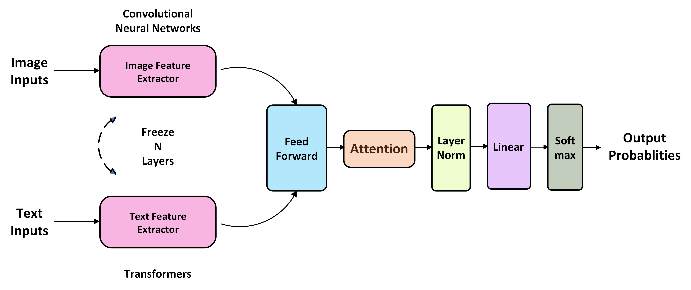
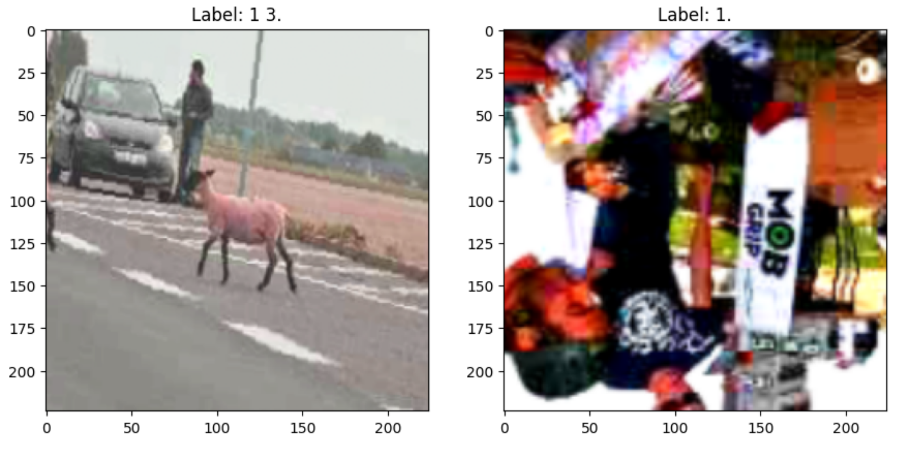
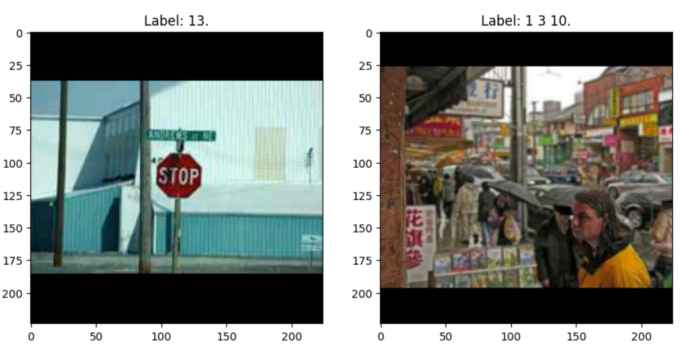
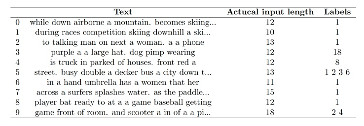
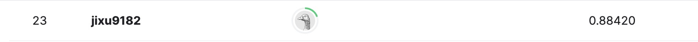
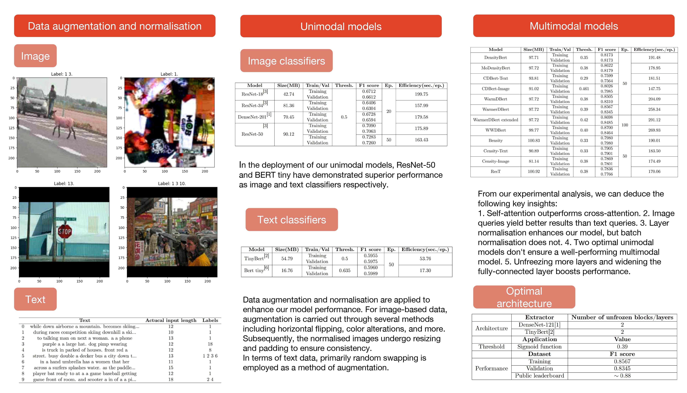

[English Version](README.md) | 中文版

# :heart_eyes_cat: CAT:  Convolutions, Attention & Transformers
:rocket: 深入**CAT**的世界！想象一下，如果计算机能够像我们人类自然做的那样理解并结合图片和文字的本质。通过结合卷积（想象它像图片滤镜背后的魔法）和变形器（语言模型背后的高级技术）的优势，我们的**CAT**框架成为一座桥梁，无缝融合视觉和文本领域。所以，无论你是欣赏日落照片还是阅读诗意的描述，**CAT**都试图解码、理解并和谐地将它们结合在一起。

想要快速上手？ 直接在Google Colab中探索我们的Jupyter笔记本吧！ [](https://colab.research.google.com/github/XavierSpycy/CAT-ImageTextIntegrator/blob/main/notebook.ipynb)

# :book:
## :sparkles: 1. 引言
在这个实验性的努力中，我们提议了一种创新的模型结构，该结构利用卷积神经网络（CNNs）从图像中提取显著特征，并利用基于变形器的模型从文本数据中获取复杂的模式。称为**C**onvolutions, **A**ttention & **T**ransformers 或 **CAT** 框架，该结构巧妙地整合了注意力机制。这些机制作为中间的通道，促进了视觉和文本模式的无缝融合。

<p align="center">
  
  <br>
  这才是我的“猫”!
</p>

<p align="center">
  
  <br>
  嗯...不是这只“猫”.
</p>

## :sparkles: 2. 最优模型超参数
<div align="center">
<table style="text-align: center;">
  <tr>
    <td align="center" colspan="4"><strong>架构</strong></td>
  </tr>
  <tr>
    <td align="center" rowspan="3">提取器</td>
    <td align="center">模态</td>
    <td align="center">模块</td>
    <td align="center">未解冻的层数</td>
  </tr>
    <td align="center">图像</td>
    <td align="center">DenseNet-121</td>
    <td align="center" rowspan="2">2</td>
  <tr>
    <td align="center">文本</td>
    <td align="center">TinyBert</td>
  </tr>
  <tr>
    <td align="center" rowspan="4">并行</td>
    <td align="center">属性</td>
    <td align="center">模块</td>
    <td align="center">输入维度的大小</td>
  </tr>
    <td align="center" rowspan="3">全连接</td>
    <td align="center">批量归一化</td>
    <td align="center" rowspan="3">896</td>
  </tr>
  </tr>
    <td align="center">修正线性单元（ReLU）</td>
  </tr>
  </tr>
    <td align="center">丢弃层（Dropout）</td>
  </tr>
  </tr>
    <td align="center" colspan="4">注意力</td>
  </tr>
  </tr>
    <td align="center" rowspan="2">分类器</td>
    <td align="center">属性</td>
    <td align="center">模块</td>
    <td align="center">输入维度的大小</td>
  </tr>
  </tr>
    <td align="center" colspan="2">线性层</td>
    <td align="center">896*2</td>
  </tr>
</table>
</div>

<div align="center">
<table style="text-align: center;">
  <tr>
    <td align="center" colspan="4"><strong>训练过程</strong></td>
  </tr>
    <tr>
    <td align="center"></td>
    <td align="center">类</td>
    <td align="center">细节</td>
  </tr>
  <tr>
    <td align="center" rowspan="2">策略</td>
    <td align="center">批量大小</td>
    <td align="center">16</td>
  </tr>
  <tr>
    <td align="center">轮次数</td>
    <td align="center">50</td>
  </tr>
  <tr>
    <td align="center" rowspan="4">优化</td>
    <td align="center">损失函数</td>
    <td align="center">带对数几率的二元交叉熵（Binary Cross Entropy With Logits）</td>
  </tr>
  <tr>
    <td align="center">优化器</td>
    <td align="center">AdamW</td>
  </tr>
  <tr>
    <td align="center">学习率</td>
    <td align="center">1e-5</td>
  </tr>
  <tr>
    <td align="center">偏差修正（Bias Correction）</td>
    <td align="center">False</td>
  </tr>
  <tr>
    <td align="center" rowspan="3">辅助</td>
    <td align="center">学习率调度器</td>
    <td align="center">线性</td>
  </tr>
   <tr>
    <td align="center">预热步数</td>
    <td align="center">0</td>
  </tr>
  </tr>
   <tr>
    <td align="center">训练步数</td>
    <td align="center">总批量数</td>
  </tr>
  <tr>
    <td align="center">预测</td>
    <td align="center">阈值</td>
    <td align="center">0.39</td>
  </tr>
</table>
</div>

## :sparkles: 3. 数据处理

:bulb: 如何处理多模态数据？这是一个好问题！

### 3.1 图像数据
```python
# 自定义图像数据集
class ImageDataset(Dataset):
  def __init__(self, imgid_label, img_folder, transform=None):
    self.imgid_label = imgid_label
    self.img_folder = img_folder
    self.transform = transform

  def __getitem__(self, idx):
    imgid_ = self.imgid_label[idx][0]
    label_ = self.imgid_label[idx][1]
    img_path = os.path.join(self.img_folder, imgid_)
    img = Image.open(img_path).convert("RGB")
    if self.transform:
      img = self.transform(img)
    return img, label_

  def __len__(self):
    return len(self.imgid_label)

# 定义一个归一化变换，包括调整大小和填充
class ResizeLongEdgeAndPad(object):
  def __init__(self, size, padding_mode='constant', fill=0):
    self.size = size
    self.padding_mode = padding_mode
    self.fill = fill

  def __call__(self, img):
    w, h = img.size
    if h > w:
      new_h = self.size
      new_w = int(self.size * w / h)
    else:
      new_w = self.size
      new_h = int(self.size * h / w)

    img = img.resize((new_w, new_h), Image.BICUBIC)

    pad_w = self.size - new_w
    pad_h = self.size - new_h

    padding = (pad_w // 2, pad_h // 2, pad_w - pad_w // 2, pad_h - pad_h // 2)
    return ImageOps.expand(img, padding, fill=self.fill)

augments = transforms.Compose([
    transforms.RandomHorizontalFlip(),
    transforms.RandomVerticalFlip(),
    transforms.RandomRotation(20),
    transforms.ColorJitter(brightness=0.5, contrast=0.5, saturation=0.5, hue=0.1),
    transforms.Resize(232),
    transforms.RandomResizedCrop((224, 224), scale=(0.1, 1), ratio=(0.7, 1.0/0.7)),
    transforms.ToTensor(),
    transforms.Normalize([0.485, 0.456, 0.406], [0.229, 0.224, 0.225])
    ])

# 为测试集定义归一化方法
normalise = transforms.Compose([
    ResizeLongEdgeAndPad(224),
    transforms.ToTensor(),
    transforms.Normalize([0.485, 0.456, 0.406], [0.229, 0.224, 0.225])
])
```
<p align="center">
  
  <br>
  图像数据增强
</p>

<p align="center">
  
  <br>
  图像数据标准化
</p>

### 3.2 文本数据
```python
min_length=23
# 定义文本数据增强 - 随机交换
def random_swap(words, n):
  words = words.copy()
  for _ in range(n):
    if len(words) < 2:
      break
    idx1, idx2 = random.sample(range(len(words)), 2)
    words[idx1], words[idx2] = words[idx2], words[idx1]
  return words

# 自定义文本数据集
class TextDataset(Dataset):
  def __init__(self, txt_label, tokenizer, max_length, random_swap_=False):
    self.txt_label = txt_label
    self.tokenizer = tokenizer
    self.max_length = max_length
    self.random_swap_ = random_swap_

  def __len__(self):
    return len(self.txt_label)

  def __getitem__(self, idx):
    text = self.txt_label[idx][0]
    label = self.txt_label[idx][1]
    if self.random_swap_:
      words = text.split()
      words = random_swap(words, n=min_length)
      text = ' '.join(words)

    encoding = self.tokenizer.encode_plus(
        text,
        add_special_tokens=True,
        max_length=self.max_length,
        return_token_type_ids=False,
        padding='max_length',
        truncation=True,
        return_attention_mask=True,
        return_tensors='pt',
    )

    return {
        'input_ids': encoding['input_ids'].flatten(),
        'attention_mask': encoding['attention_mask'].flatten(),
        'label': torch.tensor(label, dtype=torch.long)
    }
```
<p align="center">
  
  <br>
  随机交换
</p>

### 3.3 多模态数据
```python
class MultimodalDataset(Dataset):
  def __init__(self, imgid_txt_label, img_folder, tokenizer, max_length, transform=None, random_swap_=False):
    self.imgid_txt_label = imgid_txt_label
    self.img_folder = img_folder
    self.tokenizer = tokenizer
    self.max_length = max_length
    self.transform = transform
    self.random_swap_ = random_swap_

  def __len__(self):
    return len(self.imgid_txt_label)

  def __getitem__(self, idx):
    imgid_ = self.imgid_txt_label[idx][0]
    text = self.imgid_txt_label[idx][1]
    label = self.imgid_txt_label[idx][2]
    # 图像操作
    img_path = os.path.join(self.img_folder, imgid_)
    img = Image.open(img_path).convert("RGB")
    if self.transform:
      img = self.transform(img)
    # 文本操作
    if self.random_swap_:
      words = text.split()
      words = random_swap(words, n=5)
      text = ' '.join(words)

    encoding = self.tokenizer.encode_plus(
        text,
        add_special_tokens=True,
        max_length=self.max_length,
        return_token_type_ids=False,
        padding='max_length',
        truncation=True,
        return_attention_mask=True,
        return_tensors='pt',
    )
    txt_dict = {
        'input_ids': encoding['input_ids'].flatten(),
        'attention_mask': encoding['attention_mask'].flatten(),
        'label': torch.tensor(label, dtype=torch.long)
    }
    return img, txt_dict
```

## :sparkles: 4. 评估方法
```python
def f1_score_(y_pred, y_true, threshold=0.5):
  y_pred = torch.sigmoid(y_pred)
  y_pred = (y_pred.detach().cpu().numpy() >= threshold).astype(int)
  y_true = y_true.detach().cpu().numpy()
  return f1_score(y_true, y_pred, average='micro')
     

def model_size(model):
  buffer = BytesIO()
  torch.save(model.state_dict(), buffer, _use_new_zipfile_serialization=True)
  size = buffer.tell() / (1024*1024)
  buffer.close()
  return size
```

## :sparkles: 5. 实验比较
### 5.1 图像 vs. 文本分类器
<div align="center">
<table style="text-align: center;">
  <tr>
    <td align="center" colspan="7"><strong>图像分类器</strong></td>
  </tr>
  <tr>
    <td align="center">模型</td>
    <td align="center">大小(MB)</td>
    <td align="center">训练/验证</td>
    <td align="center">阈值</td>
    <td align="center">F1得分</td>
    <td align="center">轮次</td>
    <td align="center">效率(秒/轮次)</td>
  </tr>
  <tr>
    <td align="center" rowspan="2">ResNet-18</td>
    <td align="center" rowspan="2">42.74</td>
    <td align="center">训练</td>
    <td align="center" rowspan="10">0.5</td>
    <td align="center">0.6712</td>
    <td align="center" rowspan="8">20</td>
    <td align="center" rowspan="2">199.75</td>
  </tr>
  <tr>
    <td align="center">验证</td>
    <td align="center">0.6612</td>
  </tr>
  <tr>
    <td align="center" rowspan="2">ResNet-34</td>
    <td align="center" rowspan="2">81.36</td>
    <td align="center">训练</td>
    <td align="center">0.6406</td>
    <td align="center" rowspan="2">157.99</td>
  </tr>
 <tr>
    <td align="center">验证</td>
    <td align="center">0.6304</td>
  </tr>
  <tr>
    <td align="center" rowspan="2">DenseNet-201</td>
    <td align="center" rowspan="2">70.45</td>
    <td align="center">训练</td>
    <td align="center">0.6728</td>
    <td align="center" rowspan="2">179.58</td>
  </tr>
 <tr>
    <td align="center">验证</td>
    <td align="center">0.6594</td>
  </tr>
  <tr>
    <td align="center" rowspan="4">ResNet-50</td>
    <td align="center" rowspan="4">90.12</td>
    <td align="center">训练</td>
    <td align="center">0.7090</td>
    <td align="center" rowspan="2">175.89</td>
  </tr>
 <tr>
    <td align="center">验证</td>
    <td align="center">0.7063</td>
  </tr>
  <tr>
    <td align="center">训练</td>
    <td align="center">0.7283</td>
    <td align="center" rowspan="2">50</td>
    <td align="center" rowspan="2">163.43</td>
  </tr>
  <tr>
    <td align="center">验证</td>
    <td align="center">0.7260</td>
  </tr>
  <tr>
    <td align="center" colspan="7"><strong>文本分类器</strong></td>
  </tr>
  <tr>
    <td align="center">模型</td>
    <td align="center">大小(MB)</td>
    <td align="center">训练/验证</td>
    <td align="center">阈值</td>
    <td align="center">F1得分</td>
    <td align="center">轮次</td>
    <td align="center">效率(秒/轮次)</td>
  </tr>
  <tr>
    <td align="center" rowspan="2">Tiny Bert</td>
    <td align="center" rowspan="2">54.79</td>
    <td align="center">训练</td>
    <td align="center" rowspan="2">0.5</td>
    <td align="center">0.5955</td>
    <td align="center" rowspan="2">50</td>
    <td align="center" rowspan="2">53.76</td>
  </tr>
  <tr>
    <td align="center">验证</td>
    <td align="center">0.5975</td>
  </tr>
  <td align="center" rowspan="2">Bert Tiny</td>
    <td align="center" rowspan="2">16.76</td>
    <td align="center">训练</td>
    <td align="center" rowspan="2">0.635</td>
    <td align="center">0.5960</td>
    <td align="center" rowspan="2">50</td>
    <td align="center" rowspan="2">17.30</td>
  </tr>
  <tr>
    <td align="center">验证</td>
    <td align="center">0.5989</td>
</table>
</div>

### 5.2 单模态 vs. 多模态模型
<div align="center">
<table style="text-align: center;">
  <tr>
    <td align="center" colspan="7"><strong>单模态模型(最优)</strong></td>
  </tr>
  <tr>
    <td align="center">模型</td>
    <td align="center">大小(MB)</td>
    <td align="center">训练/验证</td>
    <td align="center">阈值</td>
    <td align="center">F1得分</td>
    <td align="center">轮次</td>
    <td align="center">效率(秒/轮次)</td>
  </tr>
  <tr>
    <td align="center" rowspan="2">ResNet-50</td>
    <td align="center" rowspan="2">90.12</td>
    <td align="center">训练</td>
    <td align="center" rowspan="2">0.5</td>
    <td align="center">0.7283</td>
    <td align="center" rowspan="4">50</td>
    <td align="center" rowspan="2">163.43</td>
  </tr>
  <tr>
    <td align="center">验证</td>
    <td align="center">0.7260</td>
  </tr>
  <tr>
    <td align="center" rowspan="2">Bert Tiny</td>
    <td align="center" rowspan="2">16.76</td>
    <td align="center">训练</td>
    <td align="center" rowspan="2">0.635</td>
    <td align="center">0.5960</td>
    <td align="center" rowspan="2">17.30</td>
  </tr>
  <tr>
    <td align="center">验证</td>
    <td align="center">0.5989</td>
  </tr> 
    <td align="center" colspan="7"><strong>多模态模型(基准)</strong></td>
  </tr>
  <tr>
    <td align="center">模型</td>
    <td align="center">大小(MB)</td>
    <td align="center">训练/验证</td>
    <td align="center">阈值</td>
    <td align="center">F1得分</td>
    <td align="center">轮次</td>
    <td align="center">效率(秒/轮次)</td>
  </tr>
  <tr>
    <td align="center" rowspan="2">DensityBert(DenseNet-121 + TinyBert)</td>
    <td align="center" rowspan="2">97.71</td>
    <td align="center">训练</td>
    <td align="center" rowspan="2">0.35</td>
    <td align="center">0.8173</td>
    <td align="center" rowspan="6">50</td>
    <td align="center" rowspan="2">191.48</td>
  </tr>
  <tr>
    <td align="center">验证</td>
    <td align="center">0.8173</td>
  </tr>
  <tr>
    <td align="center" rowspan="2">Bensity(DenseNet-201 + BertTiny)</td>
    <td align="center" rowspan="2">100.83</td>
    <td align="center">训练</td>
    <td align="center" rowspan="2">0.33</td>
    <td align="center">0.7980</td>
    <td align="center" rowspan="2">190.01</td>
  </tr>
  <tr>
    <td align="center">验证</td>
    <td align="center">0.7980</td>
  </tr>
  <tr>
    <td align="center" rowspan="2">ResT(ResNet-34 + BertTiny)</td>
    <td align="center" rowspan="2">100.92</td>
    <td align="center">训练</td>
    <td align="center" rowspan="2">0.38</td>
    <td align="center">0.7836</td>
    <td align="center" rowspan="2">170.06</td>
  </tr>
  <tr>
    <td align="center">验证</td>
    <td align="center">0.7766</td>
  </tr>
</table>
</div>

### 5.3 自注意力 vs. 交叉注意力机制
<div align="center">
<table style="text-align: center;">
  <tr>
    <td align="center" colspan="8"><strong>自注意力机制</strong></td>
  </tr>
  <tr>
    <td align="center">模型</td>
    <td align="center">查询</td>
    <td align="center">大小(MB)</td>
    <td align="center">训练/验证</td>
    <td align="center">阈值</td>
    <td align="center">F1得分</td>
    <td align="center">轮次</td>
    <td align="center">效率(秒/轮次)</td>
  </tr>
  <tr>
    <td align="center" rowspan="2">DensityBert</td>
    <td align="center" rowspan="4">/</td>
    <td align="center" rowspan="2">97.71</td>
    <td align="center">训练</td>
    <td align="center" rowspan="2">0.35</td>
    <td align="center">0.8173</td>
    <td align="center" rowspan="4">50</td>
    <td align="center" rowspan="2">191.48</td>
  </tr>
  <tr>
    <td align="center">验证</td>
    <td align="center">0.8173</td>
  </tr>
  <tr>
    <td align="center" rowspan="2">Bensity</td>
    <td align="center" rowspan="2">100.83</td>
    <td align="center">训练</td>
    <td align="center" rowspan="2">0.33</td>
    <td align="center">0.7980</td>
    <td align="center" rowspan="2">190.01</td>
  </tr>
  <tr>
    <td align="center">验证</td>
    <td align="center">0.7980</td>
  </tr>
    <td align="center" colspan="8"><strong>交叉注意力机制</strong></td>
  </tr>
  <tr>
    <td align="center">模型</td>
    <td align="center">查询</td>
    <td align="center">大小(MB)</td>
    <td align="center">训练/验证</td>
    <td align="center">阈值</td>
    <td align="center">F1得分</td>
    <td align="center">轮次</td>
    <td align="center">效率(秒/轮次)</td>
  </tr>
  <tr>
    <td align="center" rowspan="2">CDBert</td>
    <td align="center" rowspan="2">文本</td>
    <td align="center" rowspan="2">93.81</td>
    <td align="center">训练</td>
    <td align="center" rowspan="2">0.29</td>
    <td align="center">0.7599</td>
    <td align="center" rowspan="8">50</td>
    <td align="center" rowspan="2">181.51</td>
  </tr>
  <tr>
    <td align="center">验证</td>
    <td align="center">0.7564</td>
  </tr>
  <tr>
    <td align="center" rowspan="2">IMCDBert</td>
    <td align="center" rowspan="2">文本</td>
    <td align="center" rowspan="2">91.02</td>
    <td align="center">训练</td>
    <td align="center" rowspan="2">0.46</td>
    <td align="center">0.8026</td>
    <td align="center" rowspan="2">147.75</td>
  </tr>
  <tr>
    <td align="center">验证</td>
    <td align="center">0.7985</td>
  </tr>
  <tr>
    <td align="center" rowspan="2">Censity</td>
    <td align="center" rowspan="2">文本</td>
    <td align="center" rowspan="2">90.89</td>
    <td align="center">训练</td>
    <td align="center" rowspan="2">0.33</td>
    <td align="center">0.7905</td>
    <td align="center" rowspan="2">183.50</td>
  </tr>
  <tr>
    <td align="center">验证</td>
    <td align="center">0.7901</td>
  </tr>
  <tr>
    <td align="center" rowspan="2">IMCensity</td>
    <td align="center" rowspan="2">文本</td>
    <td align="center" rowspan="2">81.14</td>
    <td align="center">训练</td>
    <td align="center" rowspan="2">0.38</td>
    <td align="center">0.7869</td>
    <td align="center" rowspan="2">174.49</td>
  </tr>
  <tr>
    <td align="center">验证</td>
    <td align="center">0.7801</td>
  </tr>
</table>
</div>

### 5.4 DensityBert的变种
<div align="center">
<table style="text-align: center;">
  <tr>
    <td align="center" colspan="7"><strong>变种</strong></td>
  </tr>
  <tr>
    <td align="center">模型</td>
    <td align="center">大小(MB)</td>
    <td align="center">训练/验证</td>
    <td align="center">阈值</td>
    <td align="center">F1得分</td>
    <td align="center">轮次</td>
    <td align="center">效率(秒/轮次)</td>
  </tr>
  <tr>
    <td align="center" rowspan="2">DensityBert</td>
    <td align="center" rowspan="2">97.71</td>
    <td align="center">训练</td>
    <td align="center" rowspan="2">0.35</td>
    <td align="center">0.8173</td>
    <td align="center" rowspan="8">50</td>
    <td align="center" rowspan="2">191.48</td>
  </tr>
  <tr>
    <td align="center">验证</td>
    <td align="center">0.8173</td>
  </tr>
  <tr>
    <td align="center" rowspan="2">MoDensityBert</td>
    <td align="center" rowspan="2">97.72</td>
    <td align="center">训练</td>
    <td align="center" rowspan="2">0.38</td>
    <td align="center">0.8622</td>
    <td align="center" rowspan="2">178.95</td>
  </tr>
  <tr>
    <td align="center">验证</td>
    <td align="center">0.8179</td>
  </tr>
  <tr>
    <td align="center" rowspan="2">WarmDBert</td>
    <td align="center" rowspan="2">97.72</td>
    <td align="center">训练</td>
    <td align="center" rowspan="2">0.38</td>
    <td align="center">0.8505</td>
    <td align="center" rowspan="2">204.09</td>
  </tr>
  <tr>
    <td align="center">验证</td>
    <td align="center">0.8310</td>
  </tr>
  <tr>
    <td align="center" rowspan="2">WarmerDBert</td>
    <td align="center" rowspan="2">97.72</td>
    <td align="center">训练</td>
    <td align="center" rowspan="2">0.39</td>
    <td align="center">0.8567</td>
    <td align="center" rowspan="2">258.34</td>
  </tr>
  <tr>
    <td align="center">验证</td>
    <td align="center">0.8345</td>
  </tr>
  <tr>
    <td align="center" rowspan="2">WWDBert</td>
    <td align="center" rowspan="2">99.77</td>
    <td align="center">训练</td>
    <td align="center" rowspan="2">0.40</td>
    <td align="center">0.8700</td>
    <td align="center" rowspan="2">100</td>
    <td align="center" rowspan="2">269.93</td>
  </tr>
  <tr>
    <td align="center">验证</td>
    <td align="center">0.8464</td>
  </tr>
</table>
</div>

## :sparkles: 6. 比赛信息
* 比赛链接: [这里](https://www.kaggle.com/competitions/multi-label-classification-competition-2023)
* 我的排名
<p align="center">
  
</p>

## :sparkles: 7. 海报
<p align="center">
  
</p>

## :sparkles: 8. 项目结构
```
├── cat          
|   ├── attentions.py     
|   ├── datasets.py
|   ├── evaluator.py
|   ├── multimodal.py
|   ├── predict.py
|   ├── trainer.py
|   └── __init__.py
├── data
|   ├── data/
|   │    └── *.jpg
|   ├── train.csv
|   └── test.csv
├── model_hub      
|   └── *.pth
├── outcomes/      
│   └── *.jpg/*.png/*.jpeg
├── LICENSE
├── notebook.ipynb
├── README.md
├── README.zh-CN.md
└── requirements.txt
```
